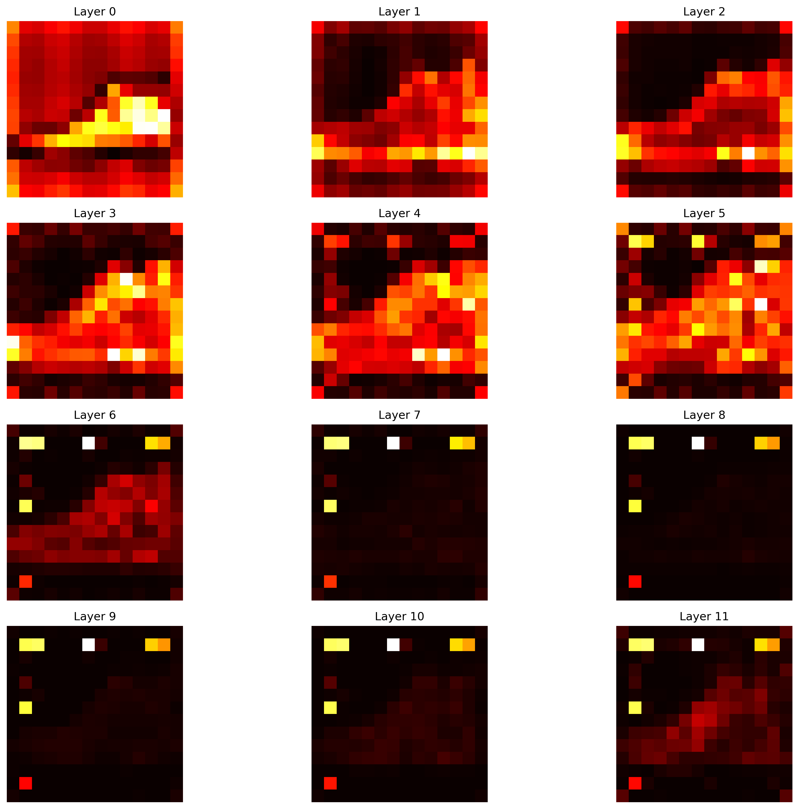
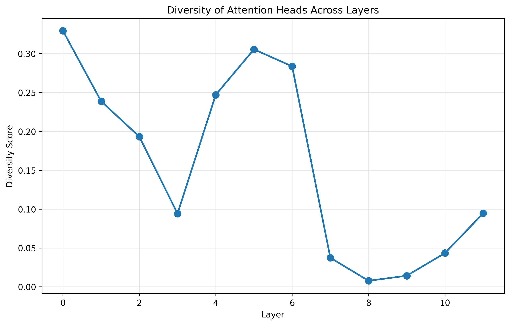
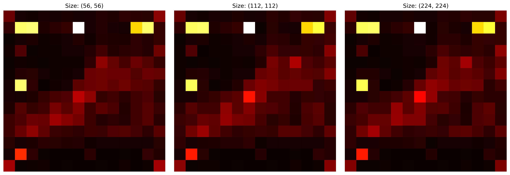
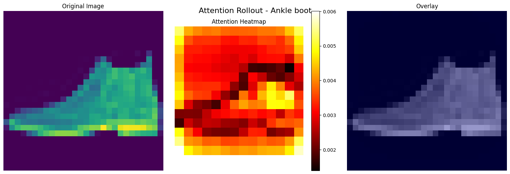

# Анализ внимания Vision Transformer

### Студент: Шайдуров Даниил Сергеевич

## Цель эксперимента
Анализ внутренних механизмов Vision Transformer через визуализацию attention-карт и интерпретацию поведения модели на датасете Fashion-MNIST.

## Методы анализа

### 1. Визуализация внимания CLS токена
- Анализ того, на какие области изображения "смотрит" модель при принятии решений
- Сравнение разных слоев трансформера

### 2. Attention Rollout
- Агрегация внимания через все слои модели
- Получение общей карты важности регионов

### 3. Сравнение голов и слоев
- Анализ разнообразия attention heads
- Изучение эволюции внимания по глубине сети

### 4. Анализ влияния разрешения
- Тестирование работы модели на разных размерах изображений
- Интерполяция позиционных эмбеддингов

## Ключевые находки

### Паттерны внимания
1. **Ранние слои**: Локальное внимание, фокус на текстурах и краях
2. **Средние слои**: Комбинация локальных признаков
3. **Поздние слои**: Глобальное внимание, фокус на семантически важных областях

### Разнообразие голов
- Высокое разнообразие в средних слоях
- Специализация голов на разных аспектах изображения

### Влияние разрешения
- Уменьшение размера ведет к более глобальному вниманию
- Увеличение размера улучшает детализацию, но требует интерполяции эмбеддингов

## Выводы

### Подтвержденные гипотезы
- ViT использует иерархическую обработку информации
- Attention heads специализируются на разных признаках
- CLS token агрегирует информацию со всего изображения

### Сильные стороны ViT
- Интерпретируемость через attention-карты
- Глобальное восприятие изображения
- Масштабируемость к разным разрешениям

### Слабые стороны
- Зависимость от позиционных эмбеддингов
- Вычислительная сложность для высоких разрешений
- Требовательность к данным для обучения с нуля

## Визуализации
1) Визуализация внимания 

2) Анализ разнообразия голов внимания

Разнообразие attention heads по слоям:
Layer 0: 0.329
Layer 1: 0.239
Layer 2: 0.193
Layer 3: 0.094
Layer 4: 0.247
Layer 5: 0.306
Layer 6: 0.284
Layer 7: 0.037
Layer 8: 0.008
Layer 9: 0.014
Layer 10: 0.043
Layer 11: 0.094

3) Сравнение работы трансформера с разными размерами изображения 

4) Визуализация rollout

## Метрики на тестовых данных 

Image 0 (Ankle boot):
  Focus Score: 0.170
  Coverage: 0.286

Image 1 (Pullover):
  Focus Score: 0.188
  Coverage: 0.168

Image 2 (Trouser):
  Focus Score: 0.176
  Coverage: 0.301

## Выводы

